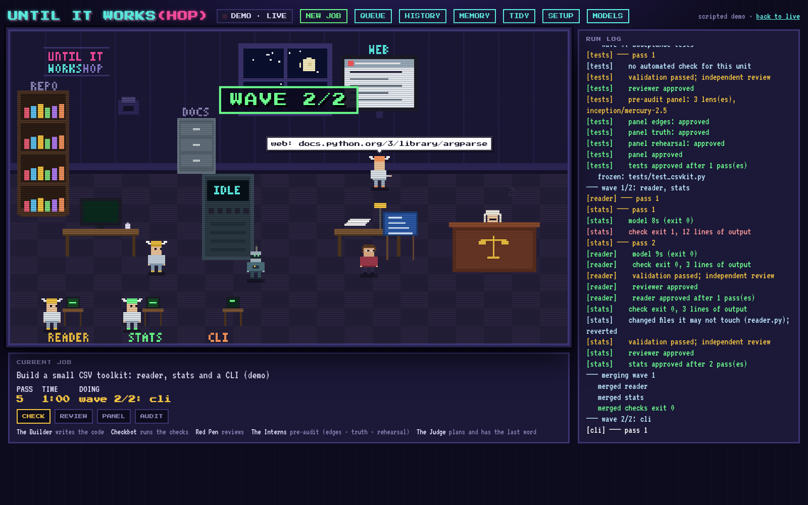

# Until It Works(hop)

**A team of AI coding agents that keeps working on your task until it genuinely
works, and a pixel-art workshop where you can watch them do it.**

You describe a task. A planner model writes a plan and a definition of "done".
Worker models build it, many passes over, or as a swarm working in parallel.
Tests, a reviewer, a panel and a final judge check every change, and the work
is only approved when all of them agree. If the agents get stuck, they ask
you a plain question and wait.

It works with the AI tools you already have: Claude, ChatGPT (Codex), Mercury,
Gemini, models through OpenRouter, and models running on your own computer.
Nothing touches your files until you choose to keep the result.



## What you need

- **macOS or Linux**
- **Python 3.9 or newer** and **git.** A Mac has both once you run
  `xcode-select --install`.
- **At least one AI coding tool, signed in.** For example Claude Code with a
  Claude subscription, or Codex with a ChatGPT plan. The setup screen shows
  which tools work with which teams.
- **Google Chrome or another Chromium browser.** Recommended, so the workshop
  opens in its own window. Any browser works.

## Quick start

**1. Install.**

```bash
git clone https://github.com/TallblokeUK/until-it-works.git
cd until-it-works
./install.sh
```

You should see `installed: mp-agent, mp-status and mp-viz in ~/.local/bin`. If
it also says `~/.local/bin is not on your PATH`, add the line it shows to your
shell profile and open a new terminal. (`mp-agent` is the command; the name is
short for multi-pass agent.)

**2. Set up.** Open **Until It Works(hop)** from your app launcher, or Launchpad
and Spotlight on a Mac (the installer adds it), or run:

```bash
mp-viz
```

The workshop opens at http://127.0.0.1:7788 with **SETUP** showing:

- **Tools:** which AI tools are installed and signed in, and the exact command
  to fix any that aren't. Press **TEST** to check one really answers.
- **API keys:** add any you want to use. They are kept in your system keychain.
- **Choose a team:** press **USE THIS TEAM** on one of the presets.
- **Protected repositories and a self-test:** protect repositories that must
  never be pushed to, and **RUN SELFTEST** to check everything with one tiny
  real job.

When the box at the top says **Ready**, you're set. [The setup guide](docs/setup.md)
walks through every part of the screen.

**3. Give it a job.** In the workshop press **NEW JOB**, or type `/mp-agent` in
Claude Code, Gemini CLI, Qwen Code, OpenCode or Cline (`$mp-agent` in Codex).
Say what you want, pick the project, and confirm the models:

```
/mp-agent add a CSV export button to the reports page
```

Watch it in the workshop. When it finishes, **VIEW CHANGES** shows the diff and
the judge's notes, and **KEEP IT** merges the work into your project. Working on
several projects? The **PROJECT** picker narrows the workshop to one of them.

## How it decides it's done

```
plan     → the planner reads your project and writes a contract: what "done" means, what's out of scope
tests    → acceptance tests are written first, then frozen so nobody can weaken them
build    → workers implement, one unit or several in parallel, each owning its own files
check    → the tests must pass
review   → a quick reviewer reads the change
panel    → three quick lenses: edge cases, things that are untrue, "what would the judge say?"
judge    → a final audit; nothing is approved without it
```

A failed step goes back to the workers with the exact reason, and the loop runs
again. There's no pass limit: it keeps going while it makes progress. When it
stops making progress, the planner rules on the disagreement, then re-plans,
and finally asks you. The models never decide for themselves that they're
finished. [How it works](docs/how-it-works.md) has the detail.

## Safe by design

- **Your checkout is never touched.** Every job runs on its own git branch in
  a separate folder. You choose to keep it, open a pull request, or throw it away.
- **Nothing is pushed or merged without you.** Pull requests are always
  confirmed first, and repositories you list as protected are never pushed to.
- **Checks can't be gamed.** Frozen tests can't be changed by the workers.
  A reviewer that edits the code has its changes rolled back. A worker that
  edits files it doesn't own has those edits reverted.
- **Spending is capped.** Set a limit per job and it pauses to ask before
  spending more. Work paid for by a subscription is shown, but not counted.
- **Your keys stay yours.** They're kept in your system keychain, shown only as
  their last four characters, and handed only to the tool call that needs them.
- **The workshop is local only.** It listens on 127.0.0.1 and refuses requests
  from other websites.

## Guides

| Guide | For |
|---|---|
| [Setting up](docs/setup.md) | tools, API keys, testing a model, choosing a team |
| [Starting a job](docs/starting-a-job.md) | from your AI tool, the workshop or a terminal; what happens to the result |
| [Choosing models](docs/models.md) | the five roles, the presets, costs and billing |
| [How it works](docs/how-it-works.md) | the loop, contracts, escalation, safety rails, the workshop |
| [Adding a tool](docs/adapters.md) | supporting another AI coding tool |
| [Lessons from the first version](docs/lessons.md) | what was measured, and why the final judge earns its cost |

## Commands

| Command | Does |
|---|---|
| `mp-viz` | open the workshop (or use the app icon) |
| `mp-agent start "task"` | start a job from a terminal (`--repo`, `--github`, `--new`, `--oneoff`) |
| `mp-status` | what's running, and any question waiting for you |
| `mp-agent answer "…"` | answer that question |
| `mp-agent setup` / `models` / `keys` / `test MODEL` | setup from a terminal |
| `mp-agent selftest` | check everything, then run one tiny real job (also a button in SETUP) |
| `mp-agent protect add owner/repo` | never push to that repository (also in SETUP) |
| `mp-agent tidy` | clear away old leftovers (never your projects or branches) |

`mp-agent --help` lists the rest.

## Costs

Until It Works(hop) itself is free. You pay for the models you choose, through
whatever you already use: a Claude or ChatGPT subscription, API keys, or
nothing at all for local models. Using a subscription through automation is
covered by that provider's terms, so check them for your plan.

## Contributing

Tests: `cd tests && python3 -m unittest`. They run on Linux and macOS with
Python 3.9 and 3.12 for every push. [Adding a tool](docs/adapters.md) explains
the one class a new AI coding tool needs.

## Licence

[MIT](LICENSE)
